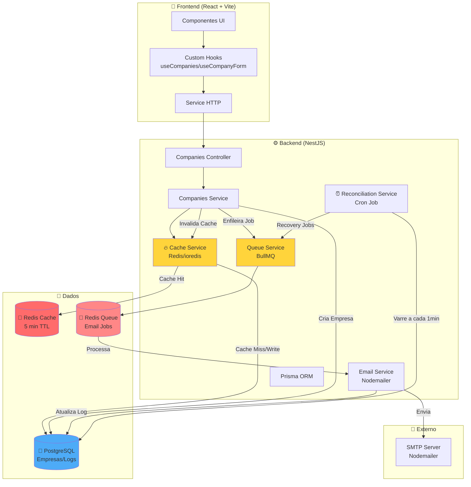
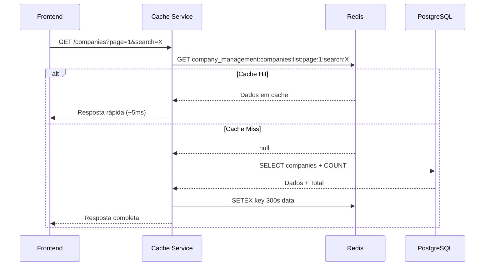
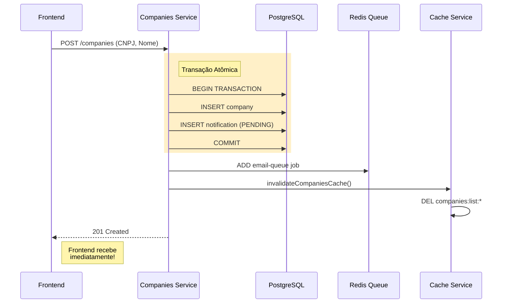
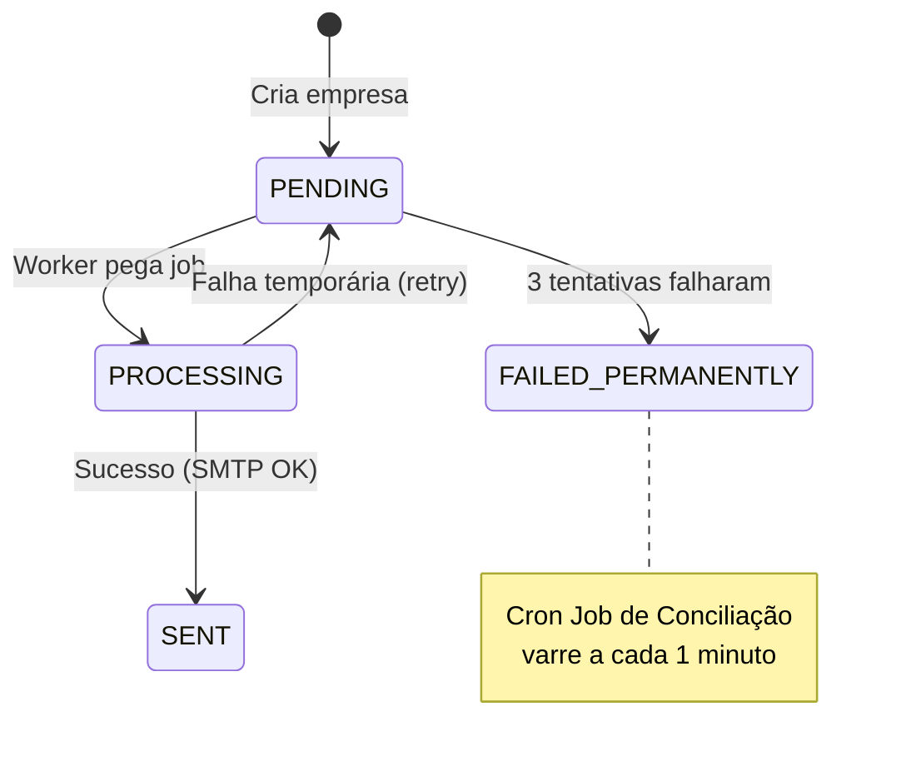

# Gestão de Empresas - Desafio Técnico Full Stack

## Visão Geral do Projeto
Esta aplicação web foi desenvolvida como solução para o desafio de Desenvolvedor Full Stack. Ela entrega um sistema completo de gerenciamento de empresas (CRUD), com interface em React, API REST em NestJS, persistência com PostgreSQL e envio de e-mails automatizados processados em segundo plano.

O foco principal foi criar uma arquitetura robusta, escalável e que demonstra conhecimento em sistemas distribuídos e resilientes.

---

## 📊 Fluxo da Arquitetura



---

## 🔄 Detalhamento dos Fluxos

### 1. Listagem de Empresas com Cache



### 2. Criação de Empresa com Invalidação



### 3. Processamento Assíncrono de E-mail



---

## Arquitetura e Decisões Técnicas

O sistema foi projetado para ser performático e desacoplado, utilizando padrões de mercado para garantir a integridade dos dados e a melhor experiência do usuário.

### 1. Frontend (React + TypeScript)
- **Desacoplamento de Lógica (Custom Hooks):** Toda a regra de negócio, integração com a API e gerenciamento de estados foram abstraídos em *Custom Hooks* (`useCompanies`, `useCompanyForm`). Isso mantém os componentes de UI limpos e focados na apresentação.
- **UX & Performance:** 
    - **Debounce Search:** A busca na listagem possui um atraso de 500ms para evitar chamadas excessivas à API enquanto o usuário digita.
    - **Validação de CNPJ em Tempo Real:** O formulário valida o algoritmo do CNPJ enquanto o usuário digita, fornecendo feedback visual imediato.
    - **Optimistic Updates & Feedback:** Uso de Toasts, Modais de confirmação e estados de loading (Skeletons) para uma interface fluida.
    - **Smart Polling:** A interface monitora o status do processamento de e-mails em tempo real quando o modal de logs está aberto.

### 2. Backend (NestJS)
- **Arquitetura em Camadas:** Separação clara entre Controllers, Services e Providers.
- **Validação Rigorosa:** Uso de `class-validator` com um validador customizado para **CNPJ**, garantindo dados íntegros.
- **Global Exception Filter:** Tratamento centralizado de erros que padroniza todas as respostas da API, facilitando o debug e o consumo pelo frontend.
- **Persistência (Prisma ORM):** Utilizado pela excelente tipagem e facilidade de manutenção em bancos relacionais (PostgreSQL).
- **Documentação Automática (Swagger):** API totalmente documentada seguindo os padrões OpenAPI 3.0.

### 3. Comunicação e Notificações (O Ponto Forte)
Diferente de implementações simples onde o e-mail é enviado durante a requisição HTTP (o que pode causar lentidão e perda de dados), esta solução utiliza uma **Arquitetura de Mensageria**:

1.  **Requisição:** O usuário cadastra uma empresa via Frontend.
2.  **Persistência:** O Backend salva os dados no **PostgreSQL** e já cria o log de notificação como `PENDING`.
3.  **Enfileiramento:** O Backend adiciona um "Job" em uma fila no **Redis** através do **BullMQ** e responde "201 Created" imediatamente.
4.  **Processamento:** Um *Worker* assíncrono processa o envio via **Nodemailer**.
5.  **Conciliação (Cron Job):** Um serviço agendado varre o banco a cada 1 minuto em busca de e-mails que falharam ou ficaram travados, tentando o re-envio automaticamente.
6.  **Proteção contra Loops:** Se um e-mail falhar 3 vezes, ele é marcado como `FAILED_PERMANENTLY`, evitando desperdício de recursos.

---

## Como Rodar o Projeto

### Pré-requisitos
- Docker e Docker Compose instalados.

### Passo a Passo
1.  **Configuração:**
    Copie o arquivo de exemplo para o ambiente real:
    `cp api/.env.example api/.env`
    *(O arquivo já vem pré-configurado para rodar com o Docker)*

2.  **Inicialização:**
    No diretório raiz, execute:
    ```bash
    docker-compose down -v && docker-compose up -d --build
    ```
    *(O comando `down -v` garante que o banco inicie limpo e o seeding seja executado)*

3.  **Acesso:**
    - **Frontend:** [http://localhost:5173](http://localhost:5173)
    - **Backend (API):** [http://localhost:3000](http://localhost:3000)
    - **Documentação Swagger:** [http://localhost:3000/api/docs](http://localhost:3000/api/docs)
    - **Painel do Banco (pgAdmin):** [http://localhost:5050](http://localhost:5050)

---

## Testes Automatizados
A aplicação conta com uma suíte de testes unitários e de integração no Backend, com **cobertura acima de 90%** nos serviços críticos.

Para rodar os testes:
1. Acesse a pasta `api`.
2. Instale as dependências: `npm install`.
3. Execute: `npm run test:cov`.
